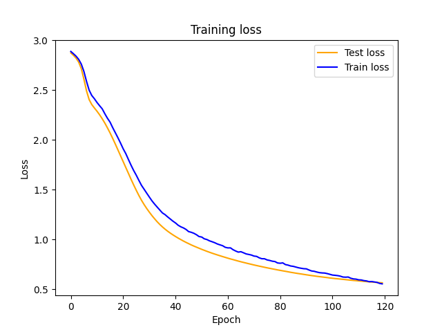

# PSTAL - Prédiction Structurée pour le Traitement Automatique des Langues

Pedagogical materials for the 2024-2025 version of the advanced NLP course
of Master 2 in AI and ML, Aix Marseille University and Centrale Marseille.

# Installation

Before compiling the report, you need to set up a Python environment and install the necessary dependencies.
```shell
conda create --name pstal python=3.12
```

```shell
conda activate pstal
```

```shell
pip install -r requirements.txt
```

# TP1 POS Labelling using Reccurent Neural Network
First let's run learn model using neural network on 100 epochs.
```shell
python pstal/tp1/sequoia/bin/main.py
```

You will have this kind of result:



Then compute evaluation score:
```shell
python pstal/tp1/sequoia/bin/accuracy.py --pred pstal/tp1/sequoia/bin/predictions.conllu --gold pstal/tp1/sequoia/sequoia-ud.parseme.frsemcor.simple.test --tagcolumn upos
```

## Authors
- Marius THORRE
- Dang Dinh NGUYEN


