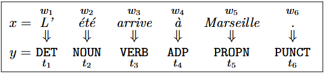
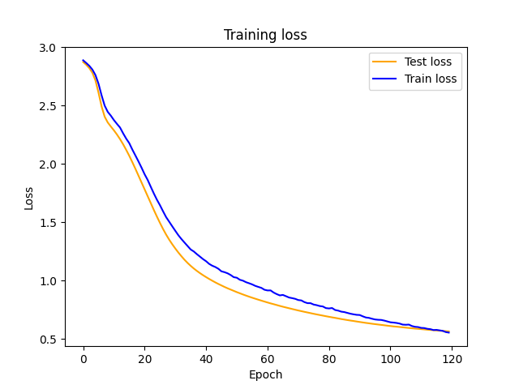

# PSTAL - Prédiction Structurée pour le Traitement Automatique des Langues

Pedagogical materials for the 2024-2025 version of the advanced NLP course
of Master 2 in AI and ML, Aix Marseille University and Centrale Marseille.

# Installation

Before compiling the report, you need to set up a Python environment and install the necessary dependencies.
```shell
conda create --name pstal python=3.12
```

```shell
conda activate pstal
```

```shell
pip install -r requirements.txt
```

# TP1: POS Labelling using Reccurent Neural Network
n this task, each word is assigned a part-of-speech (POS) tag, indicating its grammatical role in the sentence. <br>
For example, the word été is a noun (tagged as NOUN) in l’été arrive. <br>
This is a sequence labeling task because, for every input sentence w1,w2,…,wn, <br>
the goal is to predict a sequence of tags t1,t2,…,tn of the same length. <br>
The challenges of this task include: (1) some words are ambiguous (2) the context, i.e., the surrounding words, <br>
plays a crucial role in disambiguating words with multiple possible POS tags; and (3) <br>
the system must be able to predict POS tags for words not observed in the training corpus, often referred to as "OOV" (out-of-vocabulary)
 <br>

First let's run learn model using neural network using these parametters:

    batch_size = 64
    nb_epochs = 120
    max_len = 30
    embedding_size = 100
    hidden_layer = 32
You can update them in this file ``pstal/tp1/sequoia/bin/main.py``.

```shell
python pstal/tp1/sequoia/bin/main.py
```

You will have this kind of result:



Then compute evaluation score:
```shell
python pstal/tp1/sequoia/bin/accuracy.py --pred pstal/tp1/sequoia/bin/predictions.conllu --gold pstal/tp1/sequoia/sequoia-ud.parseme.frsemcor.simple.test --tagcolumn upos
```
We obtain this score: 84.36 ( 8097/ 9598).

# TP2: Named entity recognition with HMMs

The goal of this lab is to develop and evaluate a named entity recognition system using a Hidden Markov Model (HMM). <br>
This is a probabilistic system, not a neural network. Parameter estimation is based on counts from the corpus,  <br>
without iterative learning through backpropagation. <br>
Therefore, we will not be using the PyTorch library this time. <br>

1. Start training
```shell
python pstal/tp2/train_ner.py pstal/tp1/sequoia/sequoia-ud.parseme.frsemcor.simple.train pstal/tp2/simple.train.parameters.1.pkl
```

2. Compute prediction
```shell
python pstal/tp2/predict_ner.py pstal/tp2/simple.train.parameters.1.pkl pstal/tp1/sequoia/sequoia-ud.parseme.frsemcor.simple.dev pstal/tp1/predictions.dev.conllu
```

3. Compute evaluation
```shell
git clone https://gitlab.com/parseme/cuptlib.git
```
```shell
cd cuptlib | pip install . 
```
Then back to pstal folder 
```shell
cd ..
```
```shell
python pstal/tp1/sequoia/bin/accuracy.py --pred pstal/tp1/sequoia/bin/predictions.conllu --gold pstal/tp1/sequoia/sequoia-ud.parseme.frsemcor.simple.test --tagcolumn parseme:ne
```

# TP3: Sub-lexical and multi-task models for morphological analysis

The goal of this lab is to develop and evaluate a morphological analysis system. <br> 
For example, the system should predict that the word étudiantes is declined in the feminine (Gender=Fem) and plural <br>
(Number=Plur). The system will be based on a neural classifier implemented with PyTorch, <br>
which will take a sequence of words as input and predict the labels for each word. <br>
In French, suffixes often help predict morphological features. <br>
Therefore, we will process sentences character by character, rather than word by word. <br>
Additionally, the system will need to predict not just a single label but multiple key-value pairs (or none at all). <br>
Our system will therefore be more complex than the one developed for POS tagging in Lab 1. <br>

## Authors
- Marius THORRE
- Dang Dinh NGUYEN


